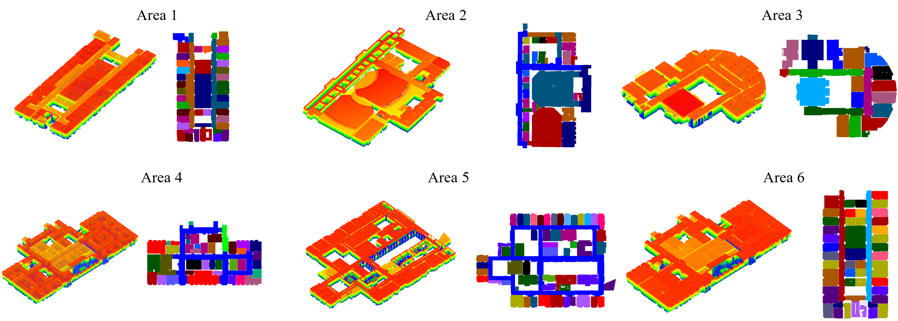
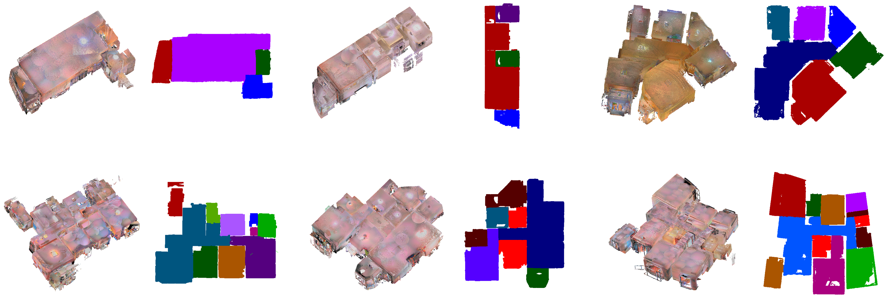
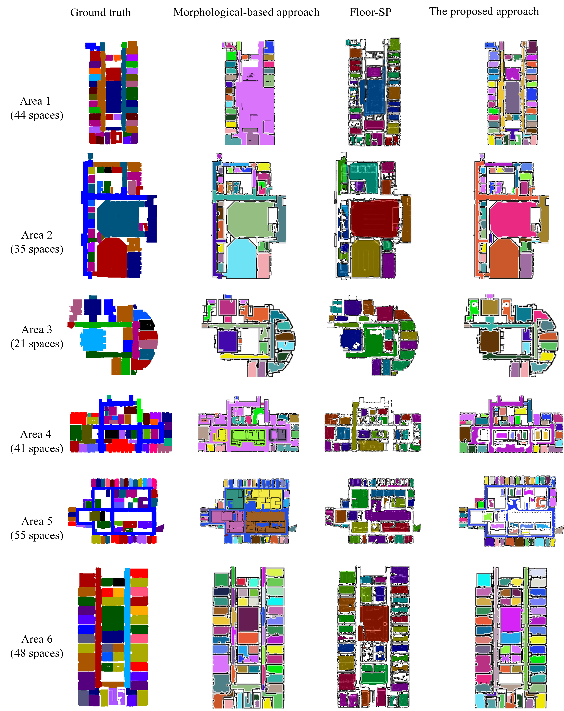

# Effective-Indoor-Space-Partitioning(EISPGeo)

Back to Geometry: Effective Indoor Space Partitioning from Point Clouds by Integrated 2D-3D Geometric Features (EISPGeo), Submitted to ISPRS Journal of Photogrammetry and Remote Sensing,2024

  

This paper proposed an easily-used and robust method for indoor scenes partitioning from point clouds that integrates both 2D and 3D geometric features. During the vertical structure extraction process, this method fully leverages the distribution characteristics of point clouds in 2D space and the local and global features in 3D space, enabling robust extraction of vertical structural information in complex indoor environments. The source code and the test data will be publicly available after the paper is accepted. 

## Data Preparation
We evaluated our approach using 96 RGB-D scans of apartments or houses from Beike dataset, as well as 6 sets of S3DIS indoor point cloud datasets. The datasets encompass a variety of indoor scenes with different complexities, sizes, and structures. 

Samples of the S3DIS Datasets

  

Samples of the Beike Datasets

  

## Experimental Results
We evaluated our approach using 96 RGB-D scans of apartments or houses from Beike dataset, as well as 6 sets of S3DIS indoor point cloud datasets. The datasets encompass a variety of indoor scenes with different complexities, sizes, and structures.To validate the effectiveness of the proposed method, the experimental section includes ablation studies and analyses for the three algorithmic innovations presented in this paper. Additionally, comprehensive comparisons and discussions with existing state-of-the-art (SOAT) spatial partitioning algorithms based on morphology and deep learning are conducted. The experimental results demonstrate that the proposed indoor space partitioning method significantly outperforms existing methods in terms of accuracy, robustness, and generalization ability. The implementation of this algorithm provides a crucial foundation for indoor space modeling and robotic navigation applications.

Results of the S3DIS Datasets

  

Results of the Beike Datasets

  

## License

This project is licensed under the Apache 2.0 License - see the [LICENSE](LICENSE) file for details.

